```{r setup, include=FALSE}
knitr::opts_chunk$set(echo = FALSE)
```


```{r}
packages = c('tidyverse','knitr')

for(p in packages){
  if(!require(p, character.only = T)){
    install.packages(p)
  }
  library(p, character.only = T)
}
```

# Data Cleaning on Tableau Prep

## Step 1: 
Download the dataset [Resident Labour Force Participation Rate by Age and Sex](https://stats.mom.gov.sg/Pages/LabourForceTimeSeries.aspx) from the Ministry of Manpower Singapore's website. 

Open the file on Excel and visually inspect the data. There are 2 worksheets in the file. Since the original chart segmented ages in levels of 5 years, the second **mrsd_Res_LFPR_2** worksheet was selected for use in the makeover. The dataset contains Resident Labour Force Participation Rate by Age and Sex from 1991 to 2021.

```{r}
knitr::include_graphics("images/DV1_01.png")
```

## Step 2:
Create 3 copies of **mrsd_Res_LFPR_2** in the Excel file. 

```{r}
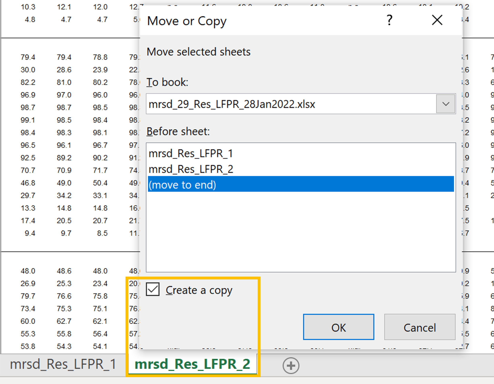
```
For each copy, keep only 1 subset of the original data(i.e. Total, Male and Female respectively) and remove the rest.  

```{r}
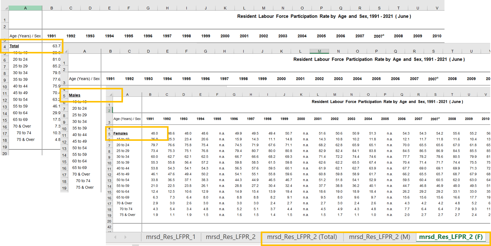
```

## Step 3
Create a new flow by opening Tableau Prep Builder and load the Excel file. Drag and drop the **mrsd_Res_LFPR_2(Total)** worksheet  into the main pane and initiate the data cleaning feature by clicking on the "+" button and selecting "Clean Step".

```{r}
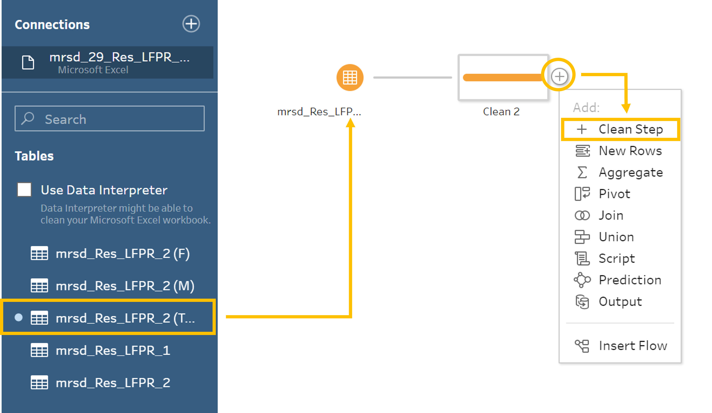
```

## Step 4:
On the lower pane,we can see that there are unusable null values. To remove these, click on the button with the three dots, followed by filter, and Null Values. Select the 'Keep only Non-Null Values' option of the dialog box

```{r}
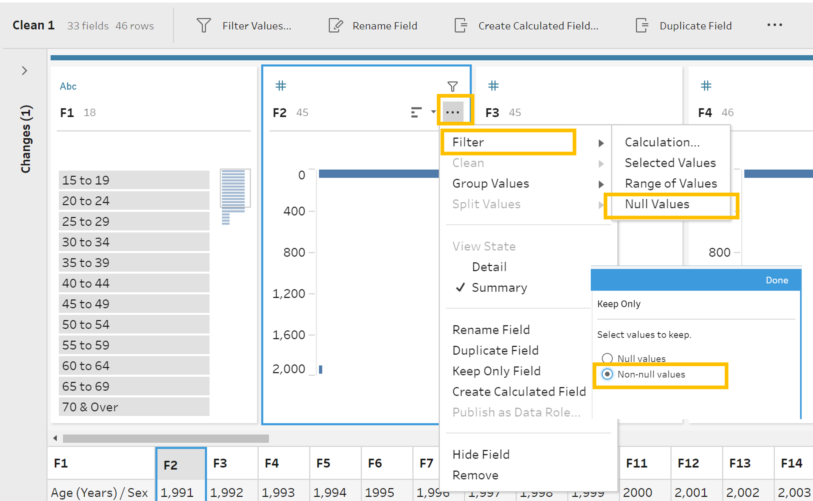
```

## Step 5:
Next, filter and remove the 20 irrelevant Year columns (1991-2009 inclusive) by selecting columns F2 to F21, clicking on the button with the three dots, and selecting Remove.

```{r}
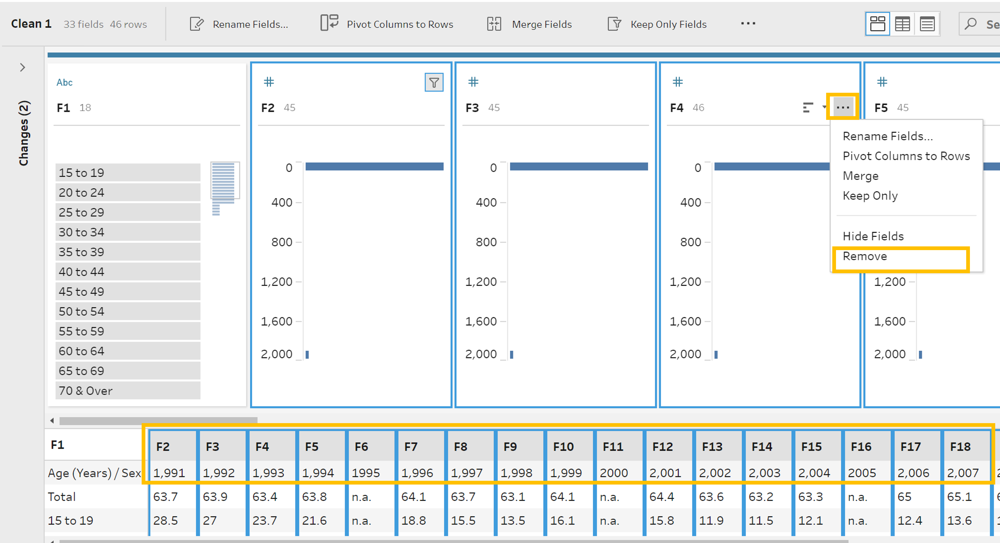
```

## Step 6:
Correctly name the remaining Year columns F22-F22 by choosing the Rename Field option and double clicking on the default column name to edit.

```{r}
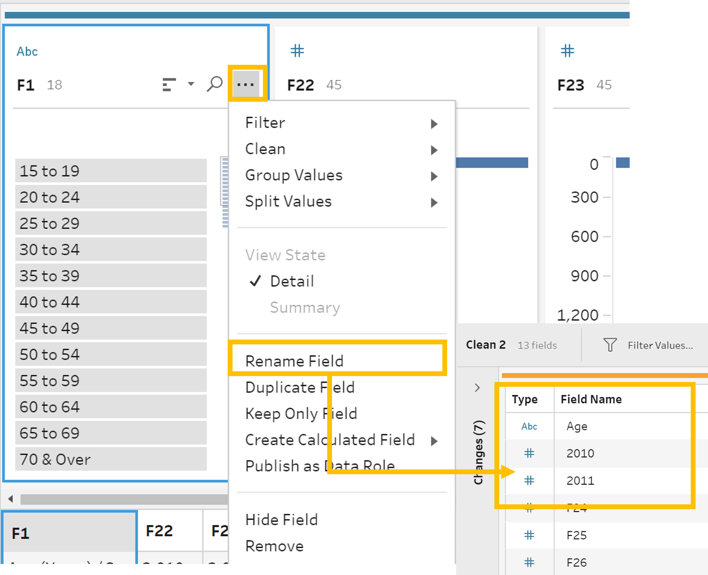
```

Then, exclude the row containing the years as values. Only the LPFR values for each age category will remain.

```{r}
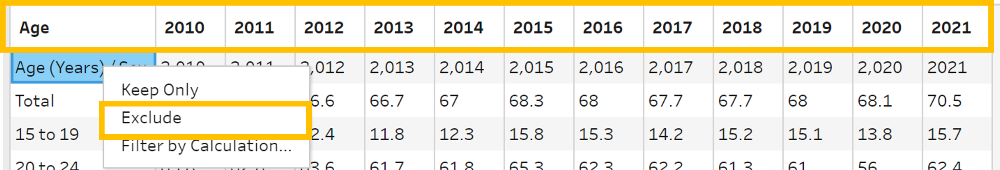
```

## Step 7:
Create a pivot table by clicking on the + circle in the flow diagram. A new Pivot icon should appear in the flow. In the resultant lower frame, Select all the Year Fields from the left-most pane and drag it to the adjacent pane titled Pivoted Fields. Ensure that the option columns to Rows is selected. Rename the resulting column *LFPR (Total)* and all other pivoted field names. The pivot table is ready.  

```{r}
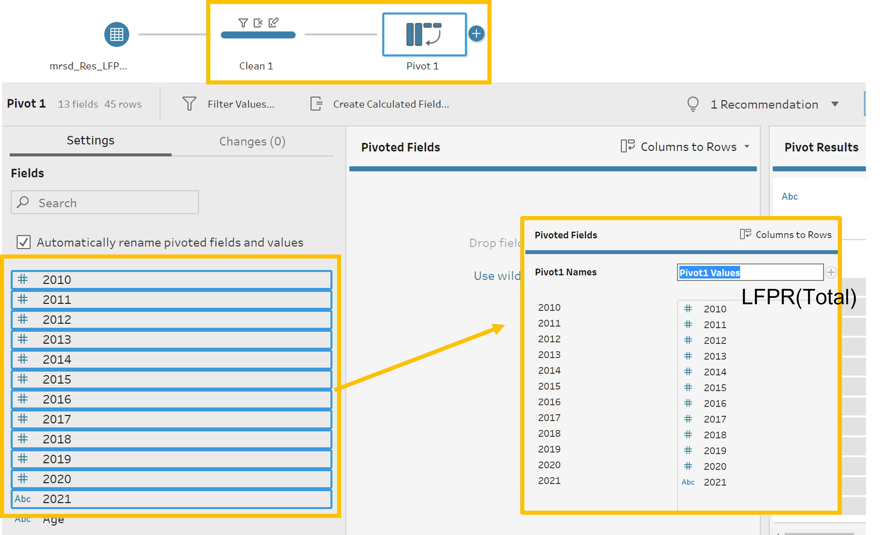
```

## Step 8:
Send the cleaned data into an output to allow it to be used in Tableau Desktop. Click on the + circle and select Output. A new Output icon should appear in the flow diagram. In the lower frame, choose the appropriate output type (csv in this case), and a new file name before clicking Run Flow.   

```{r}
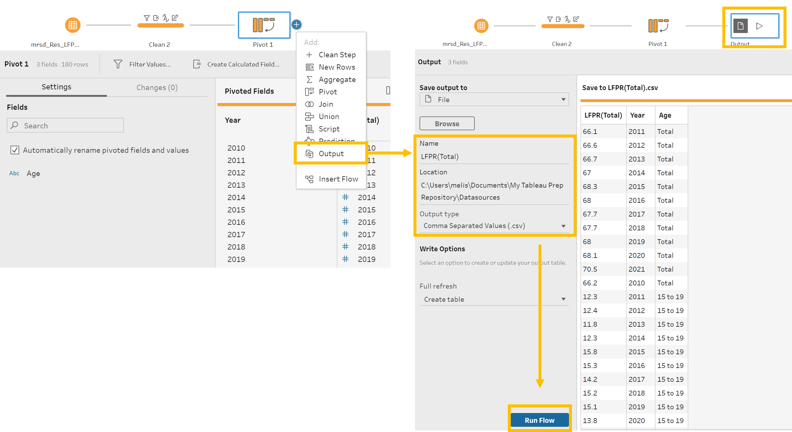
```
## Step 9:
Repeat Steps 3 to 8 for the   **mrsd_Res_LFPR_2(F)** and **mrsd_Res_LFPR_2(M)** Tables

```{r}
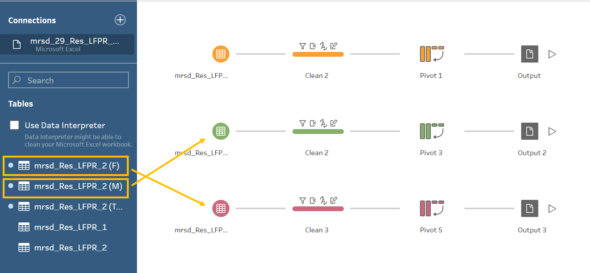
```

## Step 10:
As the difference between the LPFR of the 2 genders for any given year are needed in the visualization, a new calculated field has to be derived. Drag and hover one of the cleaned pivot table from either the **mrsd_Res_LFPR_2(F)** or **mrsd_Res_LFPR_2(M)** flows to the other and activate a Join action. A new Join icon will appear linking the 2 data tables.

```{r}
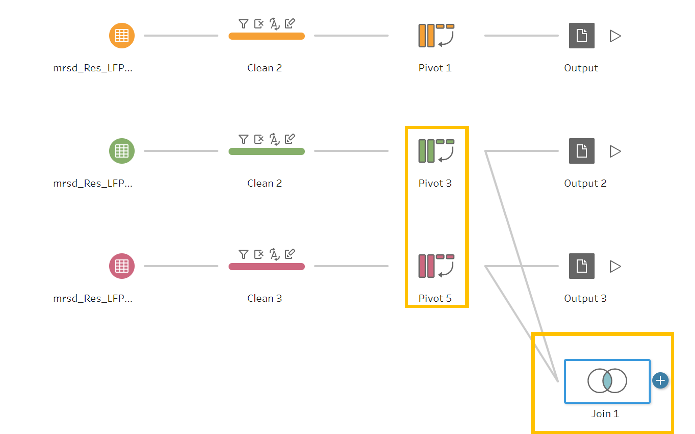
```

## Step 11:
Set the join clauses by linking the respective Year and Age fields and choosing a full Join. Then click on Create Calculated Field and specify the formula for deriving the new values ([LFPR(M)]-[LFPR(F)]). A new Field column will be formed.

```{r}
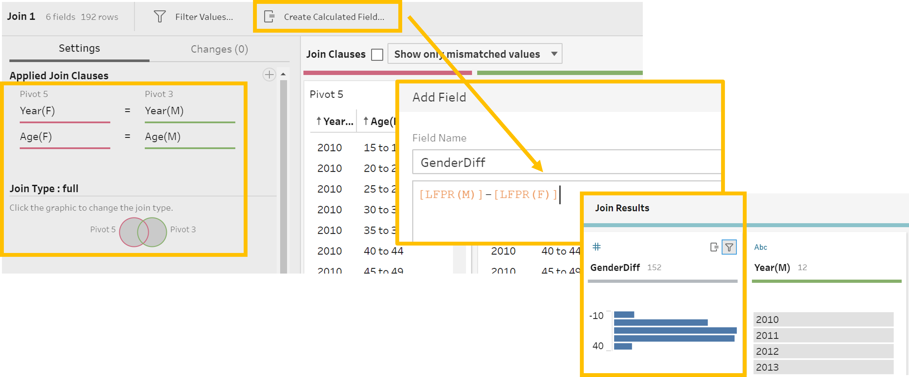
```

## Step 12:
Finally, for the data visualisation showing the aggregate difference between the LFPR of Males and Females, create a new data subset in a new excel worksheet by extracting the Males and Females row from **mrsd_Res_LFPR_2**. Create a formula to calculate the difference between the values in each year. 

```{r}
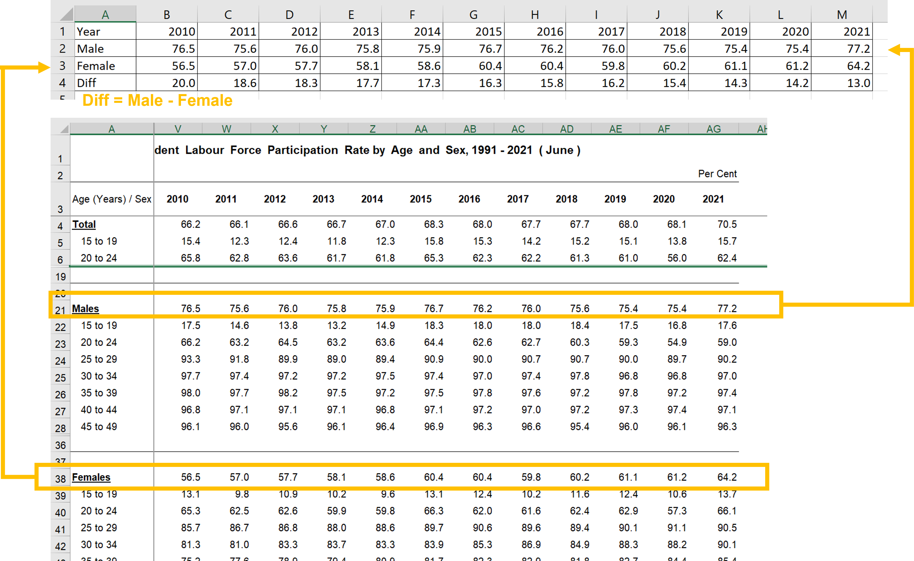
```

Import the new worksheet and data table into Tableau Prep. Remove the 3 highlighted rows (Female, Male and Year) by using Exclude, retain on the Diff row.

```{r}
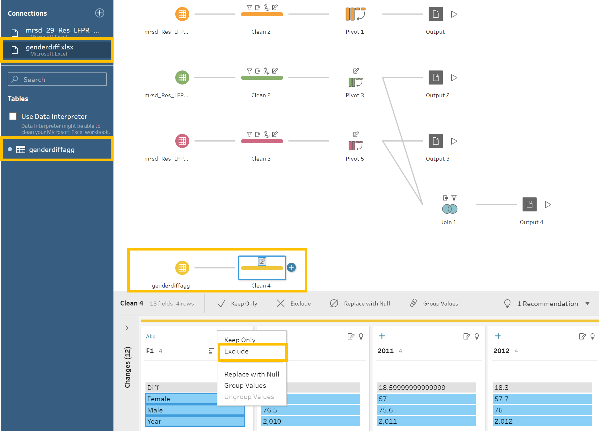
```

The final set of flow diagrams should look like this:

```{r}
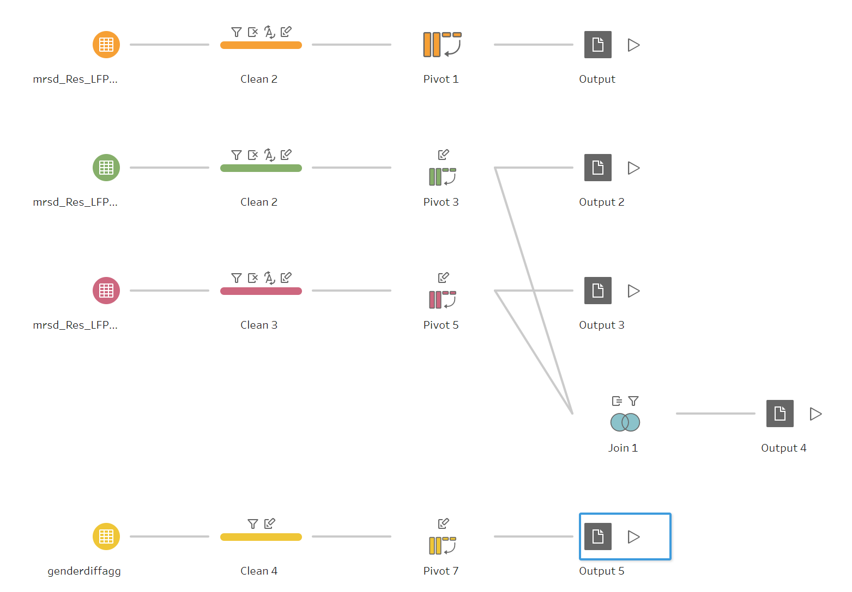
```

# Data Visualisation on Tableau Desktop

## Step 14:
Create a new connection in Tableau to load all the prepared data files. Drag and drop the 5 highlighted csv files into the main frame. Create relationships between them by linking the Year fields of each fhile to one another. Ensure the Extract radio button is checked.

```{r}
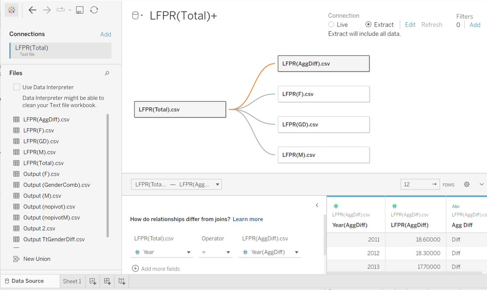
```

## Chart 1 - Overall LFPR over time, segmented by Age
## Step 15: 
Create a new worksheet and set up the axes of Chart 1 by dragging the Year and LFPR(Total) fields in the left hand menu into the Columns and Row Shelves respectively. To view the data by age segments, drag the Age field into the Color and Label boxes for the default colours and labels to show.

```{r}
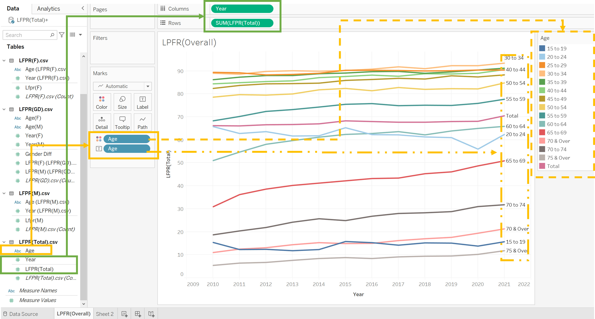
```

## Step 16: 
To exclude selected Age segments, drag the Age field into the Filters box. Select the field to be filtered out (70 & over) and Check the Exclude box. 

```{r}
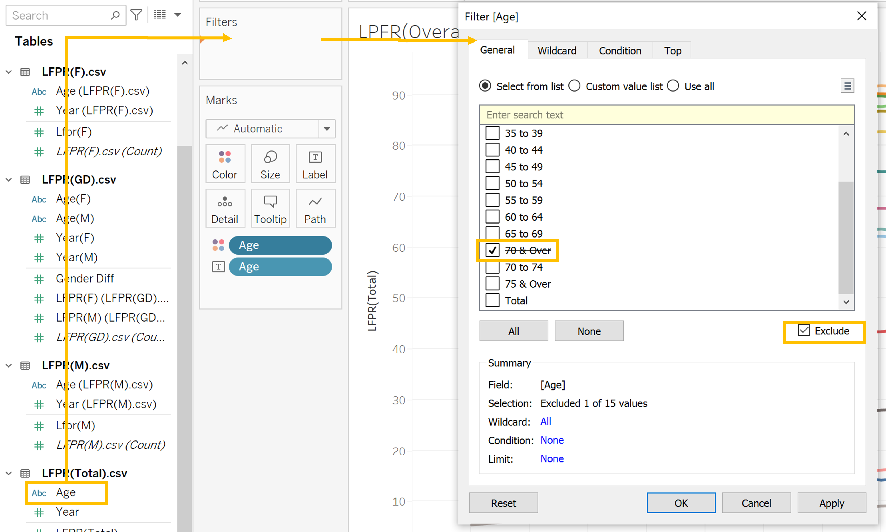
```

## Step 17: 
To change the default colours of the line graphs, click on the top right hand button on the Legend card on the right of the frame. Select Edit Colours and from the palette, change to the appropriate colors as needed.

```{r}
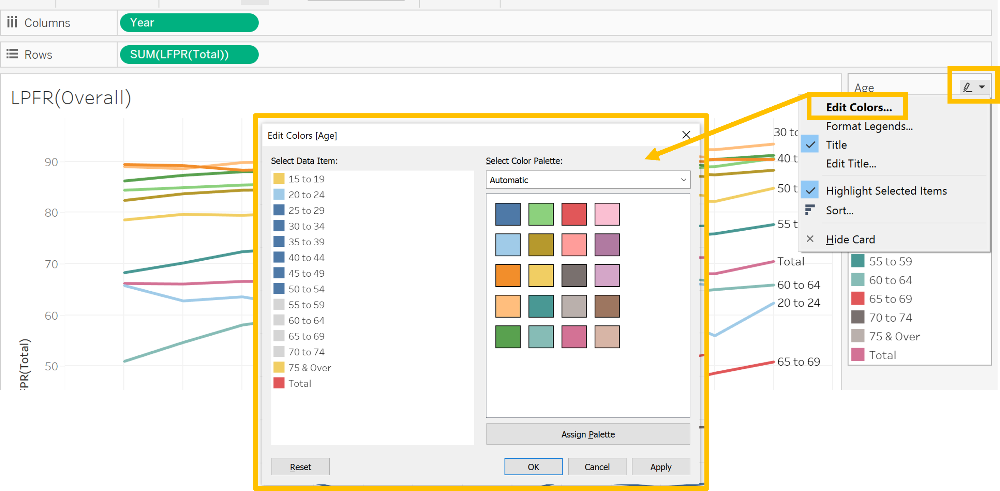
```

## Step 18: 
To change the axis range and title, open the Edit Axis dialog box by right-clicking at the horizontal axis. Choose a fixed range (2010-2022) and remove the title since the axis value are self-explanatory.

```{r}
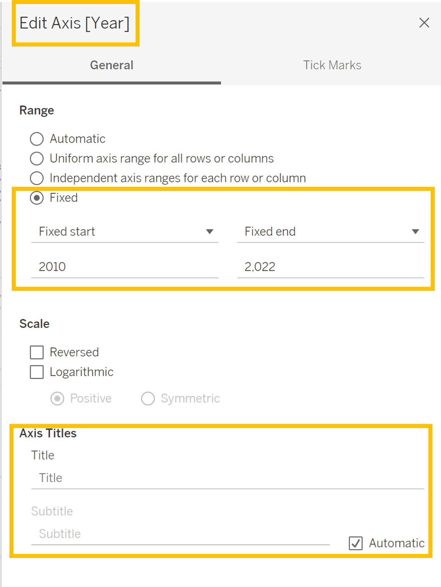
```

## Step 19: 
Edit the Chart title by double clicking on the top of the pane. Use matching mark colours to associate the observations in the write-up to the lines on the chart.

```{r}
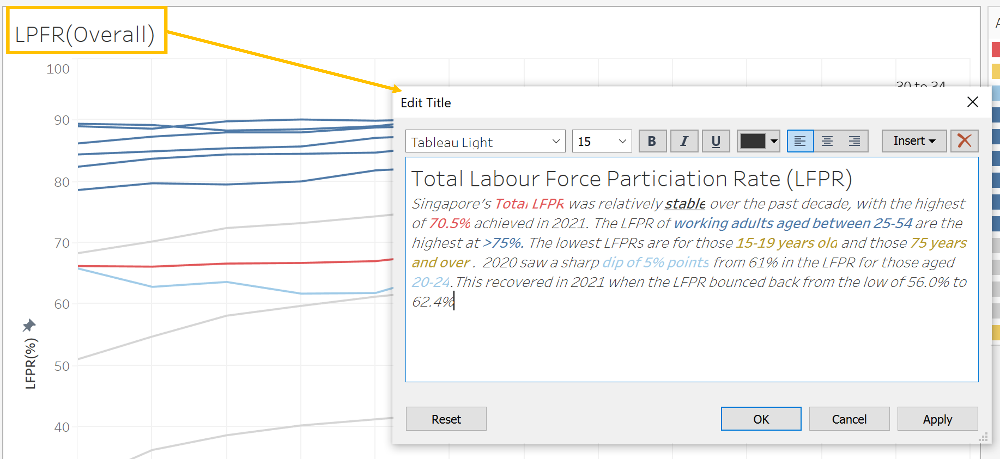
```

## Step 20: 
Add a reference line to indicate the occurence of COVID-19 by right clicking on the horizontal axis and choosing Add Reference Line. Click on the Value drop down menu and create a new Parameter COVID-19 with a current value of 2020. Select Computation as the Label to display 'COVID-19'. 

```{r}
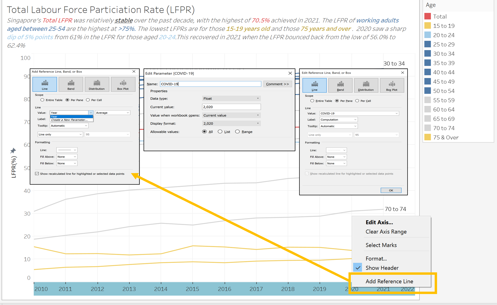
```

## Step 21: 
To edit the labels of the Age filter, Click on the Age blue pill in the side bar and select Edit Aliases from the menu. Double click on any cell in the Value (Alias) column and input the new label.

```{r}
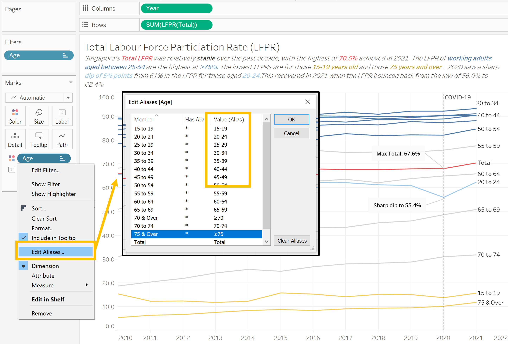
```

## Step 22: 
The final Chart 1 should look like this:

```{r}
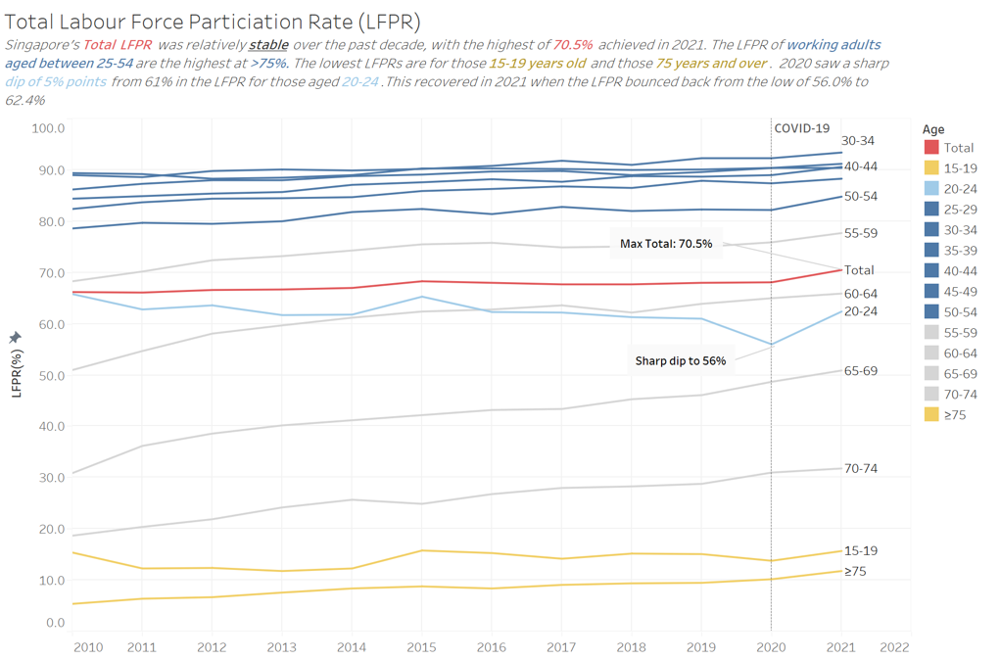
```


## Chart 2 - Changes in LFPR with Age
## Step 15: 
Create a new worksheet and set up the axes of Chart 1 by dragging the Year and LFPR(Total) fields in the left hand menu into the Columns and Row Shelves respectively. To view the data by age segments, drag the Age field into the Color and Label boxes for the default colours and labels to show.

```{r}

```

