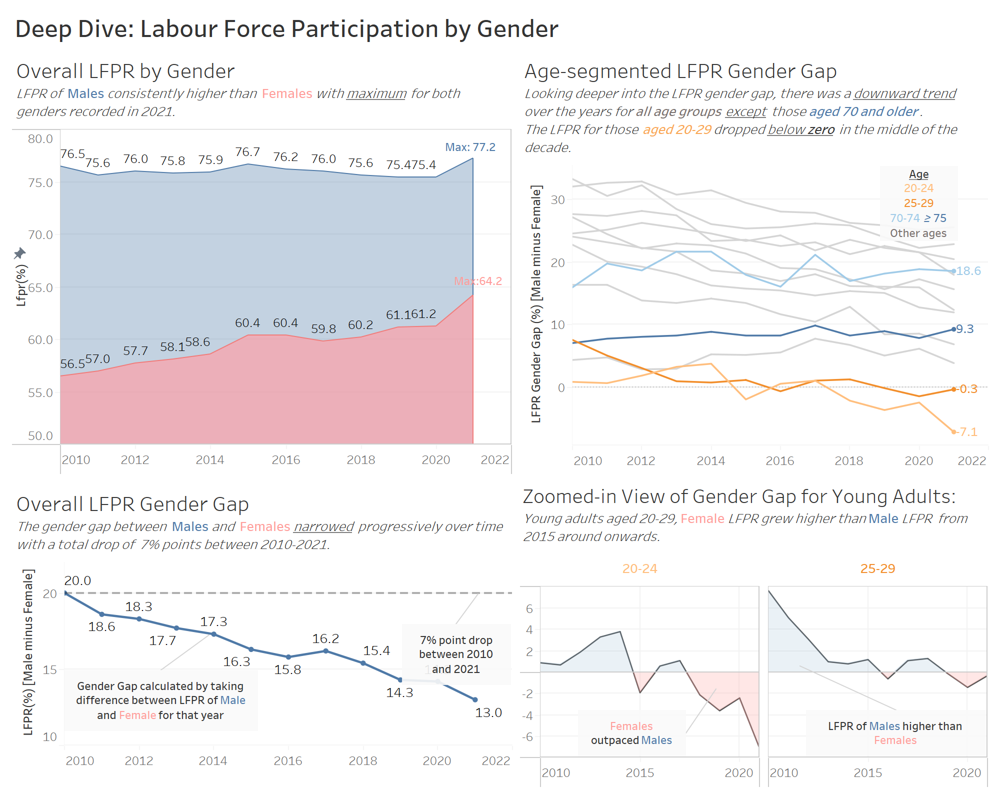
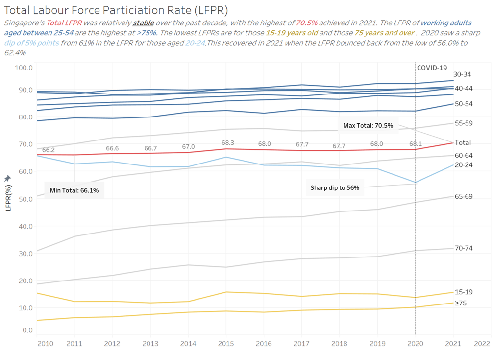
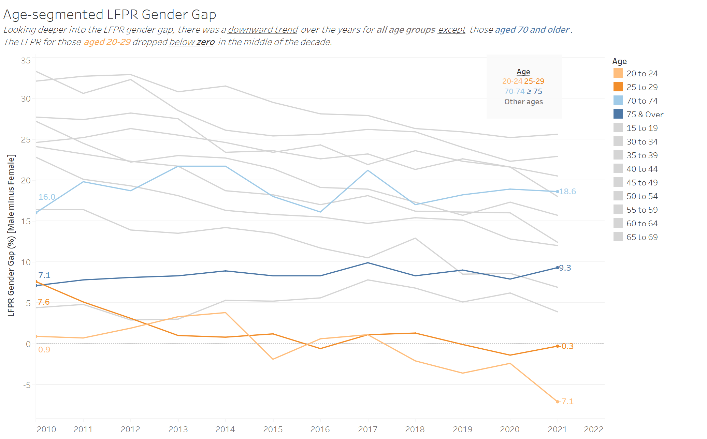

```{r setup, include=FALSE}
knitr::opts_chunk$set(echo = FALSE)
```

```{r}
packages = c('tidyverse','knitr')

for(p in packages){
  if(!require(p, character.only = T)){
    install.packages(p)
  }
  library(p, character.only = T)
}
```
# The Task

There are 5 parts to the task:

1. Critique the clarity and aesthetics of the original graph, providing at least three observations from each evaluation criterion. 

2. With reference to the critique above, suggest an alternative graphical presentation to improve the current design, providing descriptions of the advantages or solutions provided by the alternative. 
  
3. Design the proposed data visualisation with Tableau.
  
4. Provide step-by-step descriptions of how the data visualisation was prepared.
  
5. Describe three major observations revealed by the data visualisation prepared.
  

# 1. Critique of Original Visualisation

The original visualisation was created from the ["*Resident Labour Force Participation Rate by Age and Sex*"](https://stats.mom.gov.sg/Pages/LabourForceTimeSeries.aspx) dataset, published by the Ministry of Manpower, Singapore.  


```{r}
knitr::include_graphics("Original.png")
```

Overall, the visualisation is assessed to be "Beautiful yet Confusing". 


## Clarity

  1. **Data**: The dataset contained information regarding both Age and Gender. However, this visualisation did not feature gender at all. This omission of a significant subset of the data might have resulted in missed insights and incomplete information to the viewer.
  

  2. **Age Levels**: The visualisation comprised of many age levels taken directly from the dataset. This is problematic in 2 areas. 
  
      + Firstly, There are overlapping categories i.e. Age-Groups *70 & Over*, *70 to 74* and *75 & Over*. Not correcting this will result in double counting. 
    
      + Next, the arrangement and sequencing of the age levels along the x-axis is also incorrect. Conventionally, age is widely understood as a variable with a fixed interval order, with values arranged either in ascending or descending order (from young to old or vice versa). The age-groups in this visualisation seem to have been rearranged in order of increasing Labour Force Participation Rate (LFPR) levels. This has resulted in the *15-19* age group being sandwiched between *70 & Over* and *70 to 74*, *20 to 24* appearing between *55 to 59* and *50 to 54* which is not only counter-intuitive, but it also makes it difficult for viewers to understand how the LFPR changes as a person matures.    
  
  3. **Axes**:The y-axis could be more clearly labelled by either spelling Labour Force Participation Rate in full or by introducing the abbreviation (LFPR) in the title. There should also be a unit of measure indicated, *%* in this case. The maximum tick mark of the y-axis should ideally show 100 rather than end at 80. For the two x-axes, the one at the top of the chart is redundant and could have been removed since the different ages are already segmented by colours. As for the Year axis at the bottom, only one year label, 2015, could be displayed given the space constraint for each age segment. At first glance, it is easy to misunderstand that the graph contains only 2015 data instead of the full range 2010-2021. Given the choice to plot side by side line charts for a 12 year period, the resultant graph was not ideal for observing trends over time as the charts were squeezed together.
  

  4. **Title**: The title of the chart is vague as it does not include where the data set is from nor the time period it covers. A simple and more appropriate title could have been "Labour Force Participation Rate in Singapore (2010-2021)". There was also no further insight provided to explain any interesting patterns or observations from the visualisation. 

## Aesthetic

  1. **Use of colours**: The choice of pastel colours made the chart less harsh on the eyes. The shading of the areas under each line chart was somewhat helpful in demonstrating relative difference in LFPR values.  However, there is a missed opportunity in that the colours, which are all of the same intensity and seemingly randomly allocated, do not encode additional meaning or information other than indicating the different levels. Colors that are different for no reason tempts the viewer to search for a meaning for the differences and might be misleading.  
  
  2. **Inking**: With the exception of the axis labels, all the other tick marks and grid lines were faded out. However, it was not clear what purpose the grid lines served since the charts are so compressed that it's difficult to figure out the x-axis labels where the gridlines connect. Further, the repeated occurrences of the highlighted Year x-axis label clutters up the chart and distract the eye.
  
  3. **Formatting**: Suitable choice of a clean background, good font and text sizes for the labels to be visible yet not distracting. The chart looks generally proportionate with an efficient placement of the long legend placed to the side. 


# 2. Proposed Design

A sketch of the proposed alternative visualisation design is shown below:
  
```{r, out.width="70%", out.height="70%", fig.align='center'}


```

The proposed alternative visualisation has 2 intentions:

## Clarity
1. **Data presented**: Similar to the original visualisation, the proposed solution will demonstrate big picture trends of how LFPR in Singapore has changed with time. Since the original visualisation used aged segments in steps of 5 years, similar segmentation will be done for the Makeover with additional effort taken to mitigate confusion regarding the many levels. 
 
   + To give more insights to the viewer, time will be interpreted in 2 dimensions - the 12 year period from 2010-2021, as well as the working lifespan from 15 years old through to 75 years and over. 
   
   + Next, the visualisation will maximise the information available in the dataset with a more focused analysis of the gender segments. Where appropriate, zoomed in views of interesting observations will be provided as well.  

2. **Chart type**: The line chart format will be kept, with the parallel x-axes layout changed to improve readability. For the additional visualisations, boxplot and dot strips were also used where they were more effective in communicating the data.

3. **Use of colours**: Unlike the original, the use of colours in this proposed alternative will not be only for decorative purposes. Colours will be used more effectively in 3 ways: 
 
   + To highlight important or interesting age segments over the rest (e.g. using red for Total or blue for "20-24"). Age segments that were less interesting were backgrounded by using a lighter grey such that their relative change patterns over time are visible, yet they do not distract viewers from the more important observations.  
  
   + To demarcate different segments (e.g. Blue for Male and Pink for Female)
  
   + To show which gender has a higher LFPR between the two in the Zoomed in View of the Gender Gap in Young Adults area chart.  


4. **Axes**: A single x-axis and y-axis were used for each visualisation to improve viewability of the LFPR patterns across time. Where multiple charts were plotted the same pane, the axes were converted to dual axes and synchronised, with only one axis retained.   

5. **Titles**: Simple and clear chart titles supported by insights on interesting patterns or observations from each visualisation.

6. **Annotations**: Reference lines were added to indicate significant events e.g. COVID-19 in 2020. Additional annotations added to charts where relevant to flag out important or noteworthy information

## Aesthetic

1. **Layout**: Used Dashboard to create a balanced layout where all charts are aligned along the width of a page. Visually, charts with the aggregate/broader overview will be placed at the top and/or left hand side, while the zoomed in/ segmented views will be at the lower half or to the right hand side of the dahsboard. The entire visualisation comprises 2 Dashboards that fits into a 1 page view which can be used together or separately if desired.

2. **Legend***: Removed need for legend by using colours to differentiate the levels

3. **Axis Labels**: Removed need for repetitive labels e.g. Year, Gender by indicating the information upfront in the titles/sub-titles

4. **Formatting**: Consistent and distinctively different fonts for titles and subtitles (for insights)

5. **Inking**: For visual content that do no contain actual data or that plays a supporting role were rendered light grey, e.g. Age segments that were less interesting, reference lines, labels, major gridlines. Sharper, more saturated colours were used to highlight important observations with the backgrounded data rendered in lighter grey or less saturated colours. 

## 3. Proposed Visualiation on Tableau

The Dashboards can be viewed on Tableau Public by clicking on these links:

+ [DataViz1: Singapore Labour Force Participation Rate, 2010-2021](https://public.tableau.com/app/profile/melissa.tan5282/viz/DataViz112/Dashboard1?publish=yes)

+ [DataViz1: Labour Force Participation Rate in Singapore by Gender (2010-2021)](https://public.tableau.com/app/profile/melissa.tan5282/viz/DataViz122/Dashboard2?publish=yes)

```{r}
knitr::include_graphics("DV01_Dashboard01.png")

```


## 4. Step-by-Step Data Preparation

Tableau Prep was used to clean and pre-process the data. Tableau Desktop was used for the visualisations. To reproduce this visualisation makeover, detailed steps can be found at the ["Data Prep Log"](https://mviz.netlify.app/dataviz_01/dataprep/dataprep_dv1) section.

## 5. Key Observations

### Observation 1: Singapore's Labour Force Participation Rate across all demographic profiles stayed resilient in spite of COVID-19, with the exception of first-jobbers

```{r}

```

Singapore's aggregated total LFPR was fairly stable across the 12-year time period with a range of 66.1%-70.5% even over the worst of the COVID-19 period in 2020 when Singapore went into lock-down. In fact, LFPRs slightly increased between 2020 and 2021 across most of the demographic profiles. The reason for this could be partly attributed to generous ["rescue packages"](https://www.channelnewsasia.com/singapore/mom-singapore-resident-employment-above-pre-covid-19-pandemic-levels-2349881) offered by the government to place more people in jobs during this period. 

The exception to this was for the 20-24 age group which saw the LFPR dipped 5% points in 2020 from 61% in 2021. This age group most likely comprised fresh graduates from tertiary institutions who were ["unable to find suitable permanent employment while looking for their first jobs. opportunities"](https://www.channelnewsasia.com/singapore/graduate-employment-survey-2020-covid-19-uni-grad-jobs-361801
) due to the uncertainties caused by the pandemic.  However, this recovered in 2021 when the LFPR bounced back from the low of 56.0% to 62.4%.

### Observation 2: Over the past decade, Singapore residents in the older age groups saw the greatest increase in Labour Force Participation Rates, with more working past official retirement age

```{r}

```

Average LFPR showed the biggest spread over the years for the older age groups (55 years and above). Notably, the LFPR of older Singapore residents in the 65-69 age group increased a remarkable 20% points between 2010 and 2021, from 30.9% to 50.9%. This phenomenon is in line with policies led by the government to support older workers who wish to continue to be in employment. The current Retirement and Re-Employment Ages are 62 and 67 respectively where employers in Singapore must re-employ qualified employees who turn 62, up to age 67. This will be raised gradually to 65 and 70 years respectively by 2030 so this trend of increasing LPFR for older demographics is likely to continue.  

### Observation 3: The gender gap in our Labour Force Participation Rate is progressively narrowing, with the younger age groups showing indications of Female LFPR outpacing Males in recent years. 

While Singapore society can be considered relatively progressive in ensuring and promoting gender equality, there is still a significant gap between Male and Female LFPR with the biggest difference of 20% points in 2010. However this gap has narrowed with time and is now at a 7% point difference in 2021. 

```{r}

```

This downward trend holds true as well across all demographic profiles with the exception of the older age group of those aged 70 and above which saw a ~2% point increase in the gap. It would be interesting to investigate further the cause of this age group bucking the trend, especially given the developments mentioned in Observation 2.

```{r, fig.align='center'}

knitr::include_graphics("LPFR(20to29).png")

```
Most interestingly, the gender gap for those aged 20-29 dropped below zero some time in the middle of the decade, from 0.9% to -7.1% for 20-24s and from 7.6% to -0.3% for the 25-29s. This indicates that the LFPR for Females was higher than that of Males. This was not observed in any of the other age profiles signalling that the younger generation, without the traditional mindsets of the roles of men and women, are more accepting of both genders playing an active role in the workforce. This is also a trend that is likely to continue into the future.   
