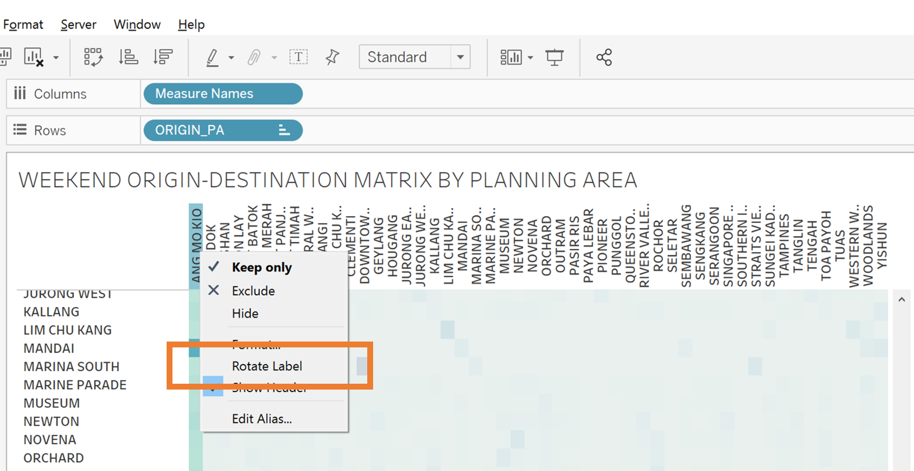

```{r setup, include=FALSE}
knitr::opts_chunk$set(echo = FALSE)
```


```{r}
packages = c('tidyverse','knitr')

for(p in packages){
  if(!require(p, character.only = T)){
    install.packages(p)
  }
  library(p, character.only = T)
}
```

# Data Cleaning on JMP Pro

## Step 1: 
Open the dataset "origin_destination_bus_SZ_202201.csv" provided for this task. Inspect for missing values and other data issues. We can see that out of more than 5 million rows, there are 29,085 missing rows for the origin fields and 26,975 missing rows for the destination fields.

```{r}
knitr::include_graphics("images/missing_values.png")
```

## Step 2:
Zoom into the missing rows to check. Use the information from the ORIGIN_PT_CODE field to backfill the missing data for ORIGIN_SZ and ORIGIN_PA. 

```{r}
knitr::include_graphics("images/missing_values2.png")
```

The search feature on the ["URA Maps website"](https://www.ura.gov.sg/maps/#) can be used to identify the correct Subzone and Planning Area for each ORIGIN_PT_CODE (bus-stop).

```{r}
knitr::include_graphics("images/uramap.png")
```

For reference, these are the missing information to look out for. It will not be wise to remove these missing rows because they contain data from populous areas and interchanges such as Yishun, Tampines, Woodlands, as well as arterial roads such as NEW UPPER CHANGI ROAD.

-	WOODLANDS REGIONAL CENTRE
-	YISHUN CENTRAL (INTERCHANGE 59008, 59009)
-	BALESTIER
-	MT PLEASANT
-	PUNGGOL FIELD
-	GALI BATU (BUKIT PANJANG)
-	BEDOK SOUTH (NEW UPPER CHANGI ROAD 84059)
-	SENTOSA
-	BISHAN EAST
-	KEAT HONG 
-	TAMPINES NORTH (76549, 75489)

Ten rows were eventually removed as they were bus-stops located in Johor Baru, Malaysia, outside the scope of the task (46211, 47711)


## Step 3
Create 2 new datatables by filtering out the dataset by DAY_TYPE (WEEKDAY AND WEEKENDS/HOLIDAY)

# Creating the adjacency matrix visualisation

## Step 4:
Create the OD matrix for the WEEKDAY datatable for each by using the split table function with the parameters organised as follows

```{r}
knitr::include_graphics("images/odmatrix.png")
```

Replace all null values with 0s. Repeat Step 4 for the WEEKEND datatable. Export both to Excel.

## Step 5:
Open the WEEKEND OD MATRIX in Excel. Creaete a new calculated field TOTAL TRIPS (ROW) by summing up each row.ting Remove.

```{r}
knitr::include_graphics("images/excel1.png")
```

## Step 6:
Create a new worksheet PCT_WKEND_TRIPS. Calculate the percentage of each cell by dividing the absolute number of trips in that cell by the row total. 

```{r}
knitr::include_graphics("images/excel2.png")
```

Repeat steps 5 and 6 for WEEKDAY OD MATRIX.

## Step 7:
Open WEEKDAY OD MATRIX Excel on Tableau. Create a new sheet and arrange the columns, rows, and details as shown below to get the adjacency matrix

```{r}
knitr::include_graphics("images/tableau1.png")
```

## Step 8:
To format the matrix, right click on the horizontal labels and select Rotate Label for the names of the planning areas to appear vertically. 

For the Filters, use the multi-select dropdown menu option for a neater and cleaner look

```{r}


```

## Step 9:
Repeat Steps 7 and 8 for WEEKEND OD MATRIX.

# Creating the chloropleth

## Step 10:
For the WEEKDAY datatables created in Step 3, use the STACK TABLE feature in JMP Pro to pivot the dataset by organising the fields as below.

```{r}
knitr::include_graphics("images/stack.png")
```

Label the new columns "Label" and "SZ_Name". You will notice that the corresponding total trips has been calculated.

```{r}
knitr::include_graphics("images/stack2.png")
```

Export the file into Excel for further processing on Tableau Prep Builder. You will realise that due to the large file size, exporting the entire file will result in a truncated dataset. 

Save the dataset in tranches of no larger than 300k rows that can be joined back in Tableau Prep.

## Step 11:
Repeat step 10 for the WEEKEND datatable.

## Step 12:
Connect to the "MP14_SUBZONE_WEB_PL.shp spatial file that contains all the map details of Singapore. The file can be found on ["URA's website"](https://data.gov.sg/dataset/master-plan-2014-subzone-boundary-no-sea)

## Step 13:
Open the WEEKDAY datasets created in step 10 in Tableau Prep Builder and use the "join" and "add" functions to rebuild the dataset. 

Drag the spatial  file into the main frame. Use the join function to link up the 2 datasets by Subzone Name

```{r}

```

## Step 14
Output the flow as an extract for use in Tableau Desktop.

## Step 15
Repeat Steps 12-14 for the WEEKEND dataset.

# Step 16

Open the extract for WEEKDAY on Tableau. Create a new sheet and arrange the columns, rows, and details as shown below to get the chloropleth

```{r}
knitr::include_graphics("images/tableau5.png")
```

## Step 17: 
Rename the options in the LABELS filter by changing the Aliases to OUTBOUND and INBOUND as shown here

```{r}

```

## Step 18: 
Format the legend by choosing the single-value drop down option for the Origin PA filter, and the single-value list option for the IN/OUTBOUND filter.

Click on the Colours option in the Marks menu and adjust the opacity to 80%

Edit the tooltip to show the following information

```{r}

```


## Step 19
Edit the Title to make it dynamically change according to the filter options selected by inserting the fields as shown

```{r}
knitr::include_graphics("images/tableau7.png")
```

## Step 20
Repeat steps 16 to 19 for the WEEKEND dataset.

# Creating the Story 

## Step 21: 
Combine all the visualisations into a single workbook by cutting and pasting the 2 sheets with the adjacency matrices to the workbook containing the chloropleths.

## Step 22:
To create the first tab in the visualisation create a new dashboard and drag the 2 sheets containing the WEEKDAY and WEEKEND chloropleths into the main frame.

```{r}

```

## Step 23: 

Create a new Story "Exploring Bus Trips in Singapore (January 2022)" by dragging the respective sheets to the tabs in the main frame.    

```{r}
knitr::include_graphics("images/tableau9.png")
```

## Step 24: 

Publish the Story to Tableau Public. 

The final visualisation should look like this:

### Main Tab
```{r}
knitr::include_graphics("images/dataviz1.png")
```

### Weekday OD Matrix Tab

```{r}
knitr::include_graphics("images/dataviz2.png")
```

### Weekend OD Matrix Tab

```{r}
knitr::include_graphics("images/dataviz3.png")

```

