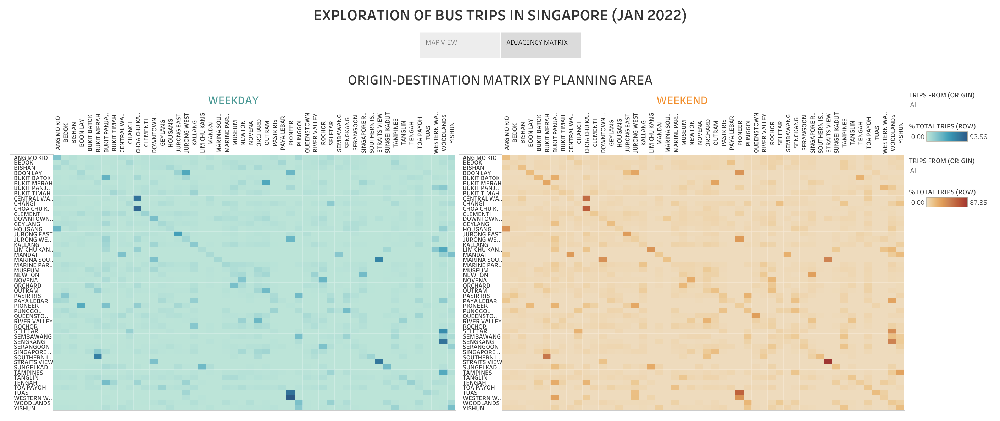

```{r setup, include=FALSE}
knitr::opts_chunk$set(echo = FALSE)
```

```{r}
packages = c('tidyverse','knitr')

for(p in packages){
  if(!require(p, character.only = T)){
    install.packages(p)
  }
  library(p, character.only = T)
}
```
# The Task

The aim of the task is to reveal inter- and intra-zonal public bus flows at the planning sub-zone level of January 2022.

There are 5 parts to the task:

1. Critique the clarity and aesthetics of the original graph, providing at least three observations from each evaluation criterion. 

2. With reference to the critique above, suggest an alternative graphical presentation to improve the current design, providing descriptions of the advantages or solutions provided by the alternative. 
  
3. Design the proposed data visualisation with Tableau.
  
4. Provide step-by-step descriptions of how the data visualisation was prepared.
  
5. Describe three major observations revealed by the data visualisation prepared.
  

# 1. Critique of Original Visualisation

The original visualisation can be found [here](https://public.tableau.com/app/profile/tskam/viz/prototype1_16468762782120/Dashboard1) on Tableau Public.  


```{r}
knitr::include_graphics("original_viz.png")
```

Overall, the visualisation is assessed to be "Confusing and Ugly" (So sorry, Prof!). 


## Clarity

  1. **Missing Dimension**: While the bar chart was useful in providing users with a view of the distribution of the bus trips over the span on each Weekday/ Weekend, the dataset contained origin-destination (OD) information regarding the bus trips, as well as data on the locations of these bus stops by Planning region, Area and Subzone. All this geographical information was not represented in the current visualisation. 

  2. **Adjacency Matrix**:The adjacency matrix is a suitable choice of chart type to visualise origin destination flows. However, the two matrices in this viz have too many levels, and are too compressed, making the matrix difficult to interpret since the different colours across the grid can hardly be distinguished from one another. The destination subzones along the horizontal of the matrix was also entirely obscured. 

  3. **Missing Data**: The dataset contained information regarding bus trips that occurred between 0,1 and 4 hours but this information was not included in the visualisation. Interesting observations on day/night flow of buses might be missed because of this.
  
  4. **Title**: The chart has no overall title to explain the what ("Bus Trips"), the what ("Origin-Destination" flows), the where ("Singapore") and the when ("January 2022") of the data. There is also no explanation that "Sz" refers to planning Subzones.
  

## Aesthetic

  1. **Too many charts**: There were too many charts in a single view, making it difficult for the viewers' eyes to focus on the most pertinent information revealed by the visualisations. 
  
  2. **Repetitive axes**: The y-axis had repeated labels for "WEEKDAY" and "WEEKEND". This took up unnecessary space on the page and could be streamlined to just a single set of labels on the left.
  
  3. **Legend**: Instead of a radio-button list, the legend could have been formatted as a multi-selection drop down menu for a cleaner and more organised look.
  
  4. **Colour**: The visualisation did not make effective use of the colour dimension to highlight interesting variations in the data e.g. differences in the relative number of trips generated to and from the subzones. The thick, monochromic bar charts and adjacency matrices were also unappealing.
  

# 2. Proposed Design

The first priority in DataViz Makeoever is to retain the original design as much as possible, and improve on the current design. To that end, the proposed design considers the following:

  1. Based on the current design, the purpose of the visualisation seems to be to compare weekday vs. weekend, inter- and intra-zonal bus trips in Singapore
  
  2. To that end, a chloropleth map of Singapore will be added to **complement** the bar charts. It is crucial for this particular dataset that we use a map to show the geographical dimension of the data. Each set of bar chart and chloropleth will be dynamically connected by linking the relevant filters. So that when viewers select an option on the filter, both charts will adjust accordingly at the same time. 
  
  
  3. The adjacency matrices will also be retained but to improve interpretability, instead of using subzones, which has 303 levels, we will use the 55 planning areas to segment each element on the grid. 
  
  4. Since the chloropleth will provide for a view by subzones, the trade-off between granularity and clarity was for the adjacency matrix to give a more user-friendly presentation while still preserving the purpose of the matrix, which is to visualise inter/intra zonal flows.
  
  5. Similar to the original, we will place both WEEKDAY and WEEKEND matrices in the same view, using colour to differentiate each. In addition, we will link the Location filter (ORIGIN_PA) of the 2 matrices so that the changes for both grids will be synchonised
  
  6. To test if this modification improved the visualisation, an adjacency matrix by Subzone was prepared for WEEKEND, and it was found that if the chart had to fit into a single screen without scrolling, it will become too compressed and not effective in showing up patterns of travel, nor was it clear in providing information on the origins and destinations.
  
```{r}

```

A sketch of the proposed alternative visualisation design is shown below:

  
```{r, out.width="70%", out.height="70%", fig.align='center'}

knitr::include_graphics("sketch2.jpg")
knitr::include_graphics("sketch1.jpg")
```

The proposed alternative visualisation tries to make the following improvements:

## Clarity

1. **Completeness of data presented**: The new design includes an important geographical dimension missing from the original. It included the full time range in the data set. Each chloropleth will provide interactive information on:

    +   The origin of the trips by each planning area - User may select planning area of interest 
    +   The time period of interest - User may select a range of options e.g. whole day, morning peak, evening peak, night etc
    +   For each selected origin planning area and time period, user will be able to do 2 things. First, by selecting "OUTBOUND" from the menu on the left, he can compare the number of trips made from this origin planning area to all the destination subzones. Second, if he is interested in which subzones the trips are originating from, he can select "INBOUND" and compare the number of trips made out from the different subzones within the selected origin planning area.  

2. **Tooltips**: The new design provides interactive information on the subzone destination and number of trips to this subzone from the origin. 

3. **Use of colours**: Unlike the original, pre-attentive use of colour was implemented to help the viewer differentiate easily between the WEEKDAY and WEEKEND information across the visualisaton. In addition, the alternative design uses the colour spectrum via the chloropleth and adjacency matrix to reveal relative differences in the trips made to and from different locations at different times of the day. 

4. **Titles**: Simple and clear chart titles supported by explanatory notes on how to navigate the visualisation. The Title will change dynamically depending on choice of filters.


## Aesthetic

1. **Bar charts**:The original bar charts were retained with some improvements to aesthetics i.e. narrowing the bars for a sleeker look, adjusting the tick-labels to show the full time range in steps of 2. The bar charts were placed side by side with the chloropleths so viewers can maintain the overview of the trip distribution over 24 hours while exploring specific time periods with the chloropleths 

2. **Layout**: Used Story to create 2 tabs within the page layout where the map views, and adjacency matrix were put in separate tabs within the same page so that we can view each visualisation more clearly, yet still give viewers the sense that it's still within  the same visualisation. The preattentive use of colour to differentiate between WEEKDAY and WEEKEND across both tabs also create a sense of continuity. 

3. **Legend**: Tidied up the legend by using multi-select drop down menu format. Included a time slider to allow user to filter by time period of interest.


## 3. Proposed Visualiation on Tableau

The Dashboards can be viewed on Tableau Public [here](https://public.tableau.com/app/profile/melissa.tan5282/viz/DataViz2_ODFLOWS/EXPLORATIONOFBUSTRIPSINSINGAPOREJAN2022)

### Map view tab
```{r}
knitr::include_graphics("dataviz9.png")
```

### Adjacency matrix tab
```{r}

```

## 4. Step-by-Step Data Preparation

A selection of programmes including Tableau Prep, JMP Pro and Excel was used to clean and pre-process the data. 

Tableau Desktop was used for the visualisations. To reproduce this visualisation makeover, detailed steps can be found at the ["Data Prep Log"](https://mviz.netlify.app/dataviz_02/dataprep2/dataprep_dv2) section.

## 5. Key Observations


### Observation 1: Bus riders living in different zones have different locus of travel.

#### Weekday Peak Periods (7-10am)

Travel during this period would usually be by workers travelling to their workplaces. By observing the different origin locations during this time period, we can see that workers living in some areas tend to have work places closer to their homes:

1. Workers living in Punggol travelled to destinations mainly on the North-east and Eastern side of Singapore, with a large proportion of intra-zone travel (as seen by the darker shades around Punggol). It also appears that many Punggol residents took the bus to Changi. These are likely airport workers.

```{r, fig.align='center'}
knitr::include_graphics("punggol.png")
```

2. On the other hand, places like Bukit Merah showed a much wider coverage, with residents travelling to destinations across the entire island, even though most of the travellers were still riding to nearby areas.

```{r, fig.align='center'}
knitr::include_graphics("bktmerah.png")
```

3. Newton revealed an interesting pattern during the evening peak from 5-8pm. As Newton can be considered a central area with many offices located here, one would expect to see that the bus trips from Newton during the evening peak would see greater coverage over the island. However, the trip pattern shows that the trips were mainly within the area, and extended out of the zone in a north/south direction, without reaching the eastern and western parts of Singapore. This contrasts with its adjacent area, Novena, where the trips out covered more extended parts of Singapore. 

```{r, fig.align='center'}
knitr::include_graphics("newton.png")
knitr::include_graphics("novena.png")
```

#### Weekend Nights (12midnight-3am)

1. The travel patterns for weekend nights revealed differences between central areas and residential areas. For e.g. Trips departing from Orchard, a shopping district, travelled widely to all parts of the island. However, the volume of rides is relatively low (58 trips max, terminating in Balestier).

2. In contrast, trips departing from Tampines are high in number (>2,000 trips max, terminating within Tampines East) but extending only to within the zone. These are likely residents who are returning home from weekend social activities and catching the feeder buses back from from the train stations.

```{r, fig.align='center'}

```

### Observation 2: Trips distribution patterns differ between weekday and weekends

1. Observing the distribution patterns for each area over WEEKDAY and WEEKEND show that on weekdays, there are obvious travel peaks at specific time periods. For e.g. the chart below shows the distribution for  **Woodlands**, a regional hub in the north of Singapore, and it can be seen that the morning peak is between 7-8am while the evening peak is between 6-7pm. In contrast, on the weekends, the trips are more evenly distributed throughout the day although overall volume is significantly lower than on weekdays. 


```{r, fig.align='center',out.width="40%", out.height="40%"}
knitr::include_graphics("woodlands.png")
```

Such patterns were typical and similar across the residential areas such as Bedok, Yishun, Bukit Panjang etc.

2. One curious exception to the norm was Boon Lay, whose trip distribution pattern had a similar shape for both WEEKDAY and WEEKEND even though volumes differed. 


```{r, fig.align='center',out.width="40%", out.height="40%" }
knitr::include_graphics("boonlay2.png")
```

### Observation 3: Some bus routes are used mainly for intra-zonal travel, others are shuttle services that go to specific zones/stops outside of the origin.

1. From the adjacency matrix, it can be clearly seen which bus routes are used mainly for intra-zonal travel, and which are shuttle services. 

    + Now that the entirety of the matrices are clearly visible, a diagonal line dissecting each grid can be seen in a deeper colour intensity. This indicates a presence of intra-zonal travel within the same planning areas. E.g. The majority (14.8%) of the buses that depart Choa Chu Kang, terminate in Choa Chu Kang, similarly for Jurong East (8.74%) and Straits View (10.91%)
    
    + There were also some rows that had only one or a few darker-coloured spots, with the rest of the row indicating no trips that indicated the presence of shuttle services. E.g. from the Southern Islands to Bukit Merah (likely a shuttle bus from Sentosa), from Tuas to Pioneer (likely to shuttle industrial workers), from Mandai to Sembawang/Woodlands/Yishun (perhaps to the Zoo), and from Boon Lay to Jurong West/Pioneer.
    
```{r, fig.align='center'}

```

The reasons for these differences are several. It might be because of the availability of cross-island buses that are more common in older/central towns like Bukit Merah, or the preferences of riders (e.g. some may prefer taking the train). It could also be planning policies that site work places closer to residential areas so people do not need to travel out too far and cause congestion during peak periods or efforts to shift trans-island travelling to the MRT trains rather than buses, limiting bus travel more to serve intra-zonal travellers covering shorter distances. 

## 6. Challenges Faced

1. The data processing proved to be difficult with this exercise. It was not ideal nor good practice to toggle between different programmes like Excel and JMP Pro. With greater proficiency in Tableau Prep Builder, the entire data cleaning process could have been done on it, reducing any potential occurrences of error during the data transfers between programmes.

2. The map visualisation could have been more effective with a spider map, showing the origin hubs connected to the surround destination points. An attempt was made to follow [these examples](https://help.tableau.com/current/pro/desktop/en-us/maps_howto_origin_destination.htm) but it was ultimately unsuccessful as the PATH-ID variable could not be correctly calibrated within the time constraints of the assignment. 
