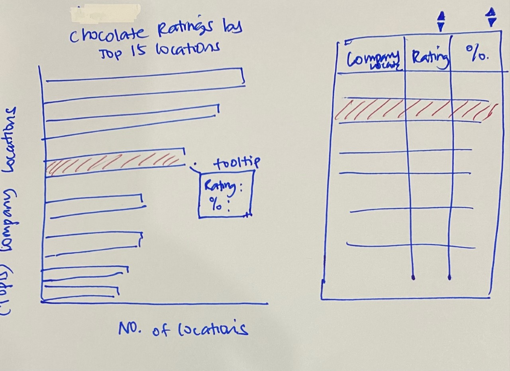

```{r setup, include=FALSE}
knitr::opts_chunk$set(echo = FALSE)
```

```{r}
packages = c('tidyverse', 'readxl', 'crosstalk', 'knitr','ggiraph','plotly','patchwork','gganimate','gapminder','DT','gifski',"gridExtra")

for(p in packages){
  if(!require(p, character.only = T)){
    install.packages(p)
  }
  library(p, character.only = T)
}
```

# 1. The Task
Create a data visualisation showing average rating and proportion of cocoa percent (% chocolate) greater than or equal to 70% by top 15 company location.

# 2. Data Preparation 
To address the requirements of the task, *chocolate.csv* data set was used. The *DT* package was installed to display an interactive datatable to augment the graph. while the *crosstalk* package was installed to link multiple HTML widgets (e.g. a graph and a datatable) within RMarkdown.


The data preparation plan was as follows:

  1. Select the 3 columns of interest, *company_location*, *rating* and *cocoa_percent* from the datatable.

  2. Group data by company location, creating a new summary table of frequency count, average rating score and average cocoa percentage for each company location.

  3. Filter out all company locations whose average cocoa percentage is less than 70%.

  4. Slice out the top 15 locations by count.
  
  
Code chunk:

```{r, echo=TRUE}
choc <- read_csv("data/chocolate.csv")

# Drop the % symbol in cocoa percent column and convert data type to numeric

choc$cocoa_percent<-gsub("%","",as.character(choc$cocoa_percent)) %>%
  as.numeric(choc$cocoa_percent)

# Select only 3 relevent columns and create new datatable grouped by company locations. 
# Keep only company locations with cococa% 70 and above

choc_loc <- choc %>%
  select(`company_location`,`rating`,`cocoa_percent`) %>%
  group_by(`company_location`) %>%
  summarise (n=n(), avgR=mean(`rating`), avgPct=mean(`cocoa_percent`)) %>%
  filter(`avgPct`>= 70) %>%
  ungroup()

# Find top 15 company locations by number
top15_n <- choc_loc %>% slice_max(`n`, n = 15)

# Format data by stipulating no. of decimal places behind rating and cocoa percent values
top15_n$avgR <- round(top15_n$avgR, digits = 2)
top15_n$avgPct <- round(top15_n$avgPct, digits = 1)
```

# 3. Visualisation Design

A sketch of the proposed visualisation is shown below. 
  
```{r, out.width="60%", out.height="60%", fig.align='center'}


```
The graph on the left will show the top 15 company locations in descending order. There will be an interactive tooltip which will display the Rating and Cocoa Percentage of the selected company location when the cursor is hovered over it.

The interactive datatable will allow users to view the list company locations in order of ratings or cocoa percentage by clicking on the sort button at the top of each column. 

As the two components will be linked, selecting any row in the table (e.g. the row with the highest rating or lowest cocoa percentage) will highlight the corresponding bar on the left to show the relative position of the company location. 

# 4. Creating the Interactive Visualisation

To create the graph described above, *ggplotly* was used with the following customisations:

  - Company location was reordered 
  - Text display on the tooltip was customised to show No. of Locations, Average Rating, and Average Cocoa Percentage
  - Colour of bars were set to brown
  - Default bars were flipped to be displayed horizontally
  
The data table was formatted to display only the Company Location, Rating and Cocoa Percentage and it was linked to the bar chart using the *crosstalk* method.

The code chunk is as follows:

```{r, echo=TRUE}
# Wrap data frame in SharedData
shared_choc = SharedData$new(top15_n)

# Render graph
bscols( widths = c(7,5),
  ggplotly((ggplot(shared_choc, aes(x=reorder(company_location,n), y=n, text = paste("Company Location: ", `company_location`,"<br>No. of Locations: ", `n`,"<br>Average Rating: ", `avgR`, "<br>Average Cocoa Percentage: ",`avgPct`,"%"))) +
  geom_bar(stat="identity", fill="saddlebrown") +
  coord_flip()+
  xlab("Company Location") +
  ylab("No. of Locations") +
  ggtitle("Chocolate Ratings by Top 15 Company Locations") +
  theme_minimal() + 
  theme(plot.title=element_text(size=9))), 
  tooltip = "text"),
  DT::datatable(shared_choc, rownames = FALSE, options = list(pageLength = 5, scrollX=T, columnDefs = list(list(visible = FALSE, targets = c(1)))),colnames = c("Company Location", "Rating","Cocoa %"))
  )
```
# 5. Challenge Encountered
One unexpected challenge encountered in this exercise was that the use of *crosstalk* would disrupt the default CSS framework of *distill*. This resulted in the usual text formatting and sizing going haywire.

Upon further research, it was due to a Bootstrap HTML dependency attached to *filter_select()*, *filter_checkbox()*, and *bscols()*. This caused *crosstalk* to degrade the overall look when used in a non-Bootstrap CSS framework like *distill*. 

RStudio developed a newer version of *crosstalk* in 2021 and the issue was resolved by installing the latest version of the package

<style>
div.blue { background-color:#e6f0ff; border-radius: 5px; padding: 10px;}
</style>
<div class = "blue">
- install.packages("remotes")
- remotes::install_github("rstudio/crosstalk")
</div>

***

# 6. References and Resources:
1. [Hands-on Exercise 3: Programming Interactive Data Visualisation with R](https://isss608-ay2021-22t2.netlify.app/hands-on_ex/hands-on_ex03/hands-on_ex03#27)

2. [Pimp my RMD: a few tips for R Markdown](https://holtzy.github.io/Pimp-my-rmd/)

3. [DT: An R interface to the DataTables library](https://rstudio.github.io/DT/)

4. [Using Crosstalk](https://rstudio.github.io/crosstalk/using.html)

5. [Plotly in R: How to make ggplot2 charts interactive with ggplotly](https://www.musgraveanalytics.com/blog/2018/8/24/how-to-make-ggplot2-charts-interactive-with-plotly)
                                                                            
6. [RStudio/crosstalk](https://github.com/rstudio/crosstalk/blob/main/NEWS.md#crosstalk-1119000)
