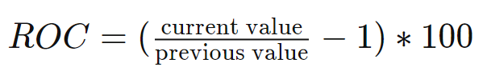

```{r setup, include=FALSE}
knitr::opts_chunk$set(echo = FALSE)
```

```{r}

packages = c('Quandl','rvest','quantmod','tidyquant','rmarkdown','tidyr','tidyverse','readxl',
             'data.table','XML','xml2','httr','rmarkdown','knitr','TTR','scales','viridis',
             'ggthemes','ggHoriPlot','writexl')
for (p in packages) {
  if(!require(p,character.only = T)){
    install.packages(p)
  }
  library(p,character.only = T)
}
```

# 1. The Task
Script stock prices of top 40 companies in Singapore by market capitalisation between 1st January 2020 - 31st December 2021 by using *tidyquant* R package.

The horizon graph method was chosen for the data visualisations. *ggHoriPlot*, a ggplot2-based R package specially designed for plotting horizon graph was used.

# 2. Data Preparation 
A list of the top 40 companies in Singapore by market capitalisation between 1st January 2020 - 31st December 2021 was downloaded from [this website](https://companiesmarketcap.com/singapore/largest-companies-in-singapore-by-market-cap/).

Only the list of Symbols was retained for subsequent use in extracting the stock prices from Yahoo Finance.

```{r, echo=TRUE}
company <- read_csv("data/companySG.csv")

Top40 <- company %>% slice_max(`marketcap`, n=40) %>% select(Symbol)

```

## Extraction from Yahoo Finance

*tidyquant* integrates resources for collecting and analyzing financial data with the tidy data infrastructure of the tidyverse, allowing for seamless interaction between each. 

The *tq_get()* method was used to get quantitative financial data ("stock.prices") from Yahoo Finance via APIs. 
The time period for the data was set from 1 January 2020 to 31 December 2021 as required.
The data was specified to be returned in weekly intervals ("weeks").

An extract of the data table in tibble format is shown below. 

```{r, echo=TRUE}

Stock40_weekly <- Top40 %>%
  tq_get(get = "stock.prices", from = "2020-01-01", to = "2021-12-31") %>%
  group_by(Symbol) %>%
  tq_transmute(select     = NULL, 
               mutate_fun = to.period, 
               period  = "weeks") 
 
knitr::kable(head(Stock40_weekly))
```               

## Understanding financial terminology

  1. **Adjusted closing price**: Stock values are stated in terms of the closing price and the adjusted closing price. The closing price is the raw price, which is just the cash value of the last transacted price before the market closes. The adjusted closing price factors in anything that might affect the stock price after the market closes. While the closing price of a stock tells you how much investors were paying for shares at the end of a trading day, the adjusted closing price gives a more accurate representation of the stock’s value and it is often used when examining historical returns or doing a detailed analysis of past performance. For this reason, the *adjusted* values were used for this data visualisation.
  
  2. **Price Rate Of Change (ROC) Indicator**: The Price Rate of Change (ROC) is a momentum-based technical indicator that measures the percentage change in price between the current price and the price a certain number of periods ago. The ROC indicator is plotted against zero, with the indicator moving upwards into positive territory if price changes are to the upside, and moving into negative territory if price changes are to the downside.
  
  -   A rising ROC above zero typically confirms an uptrend while a falling ROC below zero indicates a downtrend. Increasing values in either direction, positive or negative, indicate increasing momentum, and moves back toward zero indicate waning momentum.
  
  -   When the price is consolidating, the ROC will hover near zero. In this case, it is important traders watch the overall price trend since the ROC will provide little insight except for confirming the consolidation.
  
  -   The ROC is prone to whipsaws, sudden switching of directions, especially around the zero line. Therefore, this signal is generally not used for trading purposes, but rather to simply alert traders that a trend change may be underway.
  
  -   The formula used for calculating ROC in this exercise is shown below. With current value referring to the adjust price from the current week, and the previous value referring to the adjusted price from the preceding week.
    
```{r, out.width="40%", out.height="40%", fig.align='center'}


```

A new calculated datatable column was created to find the weekly ROC values for adjusted prices of all 40 companies.

```{r, echo=TRUE}               
Stock40_weekly$AdjustedRateChange <- ((Stock40_weekly$adjusted/shift(Stock40_weekly$adjusted)) - 1 )*100

```

# 3. Data Visualiastion 

## Horizon graph of Adjusted Stock Price 

First, *ggplot2* based R Package *gghorigraph* was used to plot horizon graphs of the adjusted stock prices of the top 40 companies by market capitalisation over the period from 1 January 2020 to 31 December 2021.

The horizon graph was chosen as it can meaningfully display 50 or so full sets of time-series values on a single screen or page in a way that supports comparisons among them.

For this visualisation, the origin line was set to "median" to reduce the effect of any potential outliers and the horizon scale was set to a red-blue palette and 6 levels, with red indicating a decrease and blue indicating an increase relative to the median.

The stocks are arranged by row, and time is displayed horizontally, from left to right. Rises and falls in stock prices relative to the median were encoded as 2-D position—lines that move up and down as they proceed from left to right. The intensity of the colours indicate the relative distance from the origin. The darker the hue, the further away, the lighter the hue, the closer to the origin. 

```{r, echo=TRUE}

a <- Stock40_weekly %>% 
  ggplot() +
  geom_horizon(aes(x = date, y=adjusted), origin = "median",horizonscale = 6)+
  facet_grid(Symbol~.)+
  theme_few() +
  scale_fill_hcl(palette = 'RdBu')+
  theme(
    panel.spacing.y=unit(0, "lines"),
    strip.text.y = element_text(size = 5, angle = 0, hjust = 0),
    legend.position = 'none',
    axis.text.y = element_blank(),
    axis.text.x = element_text(size=7),
    axis.title.y = element_blank(),
    axis.title.x = element_blank(),
    axis.ticks.y = element_blank(),
    panel.border = element_blank()
    ) +
  scale_x_date(expand=c(0,0), date_breaks = "1 month", date_labels = "%b") +
  ggtitle('Weekly Adjusted Prices (Jan 2020 to Dec 2021)') 

a
```

## Horizon graph of Adjusted Rate of Change (ROC) Indicator 

A similar horizon graph was charted for the Adjusted ROC. This time the origin was set to 0.

```{r, echo=TRUE}

a <- Stock40_weekly %>% 
  ggplot() +
  geom_horizon(aes(x = date, y=AdjustedRateChange), origin = 0)+  
  facet_grid(Symbol~.)+
  theme_few() +
  scale_fill_hcl(palette = 'RdBu')+
  theme(
    panel.spacing.y=unit(0, "lines"),
    strip.text.y = element_text(size = 5, angle = 0, hjust = 0),
    legend.position = 'none',
    axis.text.y = element_blank(),
    axis.text.x = element_text(size=7),
    axis.title.y = element_blank(),
    axis.title.x = element_blank(),
    axis.ticks.y = element_blank(),
    panel.border = element_blank()
    ) +
  scale_x_date(expand=c(0,0), date_breaks = "1 month", date_labels = "%b",
               limits = as.Date(c('2020-01-04','2021-12-31'))) +
  ggtitle('Adjusted Price Rate of Change (Jan 2020 to Dec 2021)') 

a
```

# 4. Observations and Analysis

## Singapore's COVID-19 Milestones

Before commenting on the visualisations, it is useful to understand the context of the time period under examination:

- On 7 February 2020, the Singapore Government announced the DORSCON Orange public health status, sending citizens and businesses into a state of anxiety and uncertainty about the impact of the imminent COVID-19 outbreak. 

- On March 21 2020, Singapore reported its first COVID-19 deaths. 

- From 7 April to 2 June 2020, Singapore went into an effective lock-down with everyone confined to their homes except for essential activities during the Circuit Breaker (CB). 

- In December 2020, the Multi-Ministerial Task Force announced the strategy for national vaccination and the arrival of the first batch of vaccines to Singapore. 

- Throughout 2021, the vaccination programme intensified as part of the strategy towards reopening, with the milestone of 80% national population vaccinated reported on 26 August 2021.  


## Analysis of Adjusted Price Horizon Graph

1. From the adjusted price horizon graph, sections of extremely high or low stock prices can be easily spotted because they stand out as darker patches of blue or red. 

2. It can be observed that stock prices took a severe hit across the board from March 2020 through to November 2020, before recovering from around February/March 2021 onwards. This is not surprising given the tumultuous events of 2020.

3. Some companies like ComfortDelgro (C52.SI), Singapore Airlines (SINGF), CapitalLand Mall Trust (C38U.SI), Sembcorp (U96.SI) were doing relatively well in the first 2 months of 2020 before things went south around the time when the CB was enforced and travel restrictions around the world set in causing both ground and air transportation, as well as real estate/retail businesses to come to a standstill for an extended period of time both in Singapore and in regional/Asian markets in which these companies operate.

4. Other companies like GRAB, TRIT started trading only at the end of 2020, with relatively good early performance. 
  
## Analysis of ROC Horizon Graph

When viewed together with the Adjusted Price horizon graph, the ROC horizon graph shows a more interesting picture. 

1.    Although Singapore' Prime Minister only announced the Circuit Breaker on 3 April, the darker red vertical band observed around mid-March seems to give an early indication that there could be some momentum building towards a downtrend. This turned out to be the case with the stock price performance for the 2nd half of 2020.

2. Likewise, the slightly darker blue vertical band that is visible from around November 2020 was indicative of the stock market turning the corner, and an upcoming uptrend across all the stock prices in the first half of 2021.

3. There seems to be a light red band across May 2021 potentially indicating a small shift in momentum downwards. However, this did not translate into a significant downstrend for the 2nd half of 2021. 

4. These observations suggest that there is some value in **using an ROC chart to complement the Stock Prices chart, and serve as an early indicator of upcoming trends** for investors who may wish to buy-in ahead of the mainstream.

## Analysis of Horizon graph of Adjusted Prices relative to first day of time period 

To get an even clearer picture of how these top 40 companies were impacted by COVID-19, if at all, the origin value was changed from using median, to the stock prices **on the very first trading day of the time period** i.e. 3 January 2020. 

Since the first case of COVID-19 discovered in Singapore and the formation of the Multi-Ministerial Taskforce took place only in mid January 2020, The stock prices in the earlier part of January 2020 was a good reference point for 'pre-COVID' performance.  


```{r}
Stock40_ori <- read_xlsx("Stock40Wkly.xlsx") %>%
  mutate(Symbol = reorder(Symbol, Origin, FUN=which.max)) # order company by stockprice
```


```{r}

a <- Stock40_ori %>% 
  ggplot() +
  geom_horizon(aes(x = as.Date(date), y=Origin), origin = 0)+  
  facet_grid(Symbol~.)+
  theme_few() +
  scale_fill_hcl(palette = 'RdBu')+
  theme(
    panel.spacing.y=unit(0, "lines"),
    strip.text.y = element_text(size = 5, angle = 0, hjust = 0),
    legend.position = 'none',
    axis.text.y = element_blank(),
    axis.text.x = element_text(size=7),
    axis.title.y = element_blank(),
    axis.title.x = element_blank(),
    axis.ticks.y = element_blank(),
    panel.border = element_blank()
    ) +
  scale_x_date(expand=c(0,0), date_breaks = "1 month", date_labels = "%b") +
  ggtitle('Adjusted Prices Relative to 1st Day of Period (Jan 2020 to Dec 2021)') 


a
```

As can be seen from the horizon graph above, which was reordered in ascending order of maximum increase in stock price relative to Day 1:

1. It can now be observed from the upper section of intense dark reds that some companies' stock prices were consistently performing poorer than pre-COVID levels throughout the entire time period, and had not recovered to pre-COVID levels. These include SIA (SINGF),ComfortDelgro (C52.SI) , Keppel (BN4.SI) and City Developments (C09.SI). These may be partly due to the fact that these companies' international operations are subject to external global pressures where the Delta and Omicron waves of COVID-19 hampered economic recovery much more significantly. 

2. Some companies were negatively affected by the events in 2020 but bounced back to higher than pre-COVID levels in 2021. These include DBS (DBSDF), UOB (U11.SI), Community Healthcare Trust (HCTPF), ST Engineering (SJX.F)and can be observed by how their horizon charts transitioned from red/deep red in the first half of the time period, into blues/deep blues in the second half.

3. There was also a group of companies that were not only spared the adverse impact of COVID-19, but who recovered very quickly following the circuit breaker, to **outperform pre-COVID levels** once Singapore reopened from June 2020 onwards. These included the technology and logistics companies whose services became **indispensable for Singaporeans to cope with the acceleration of digital adoption during the pandemic**. These included companies such as Sea (SE), which owns online e-commerce platform Shopee as well as video game maker Garena, FLEX (FLEX), a global supply chain solutions provider, Netlink Trust (CJLU.SI), which builds and operations fibre network infrastructure, and MapleTree Logistics Trust (M44U.SI). 

***

# 8. References and Resources:
1. [It’s About Time: Visualising and Analysing Time-Oriented Data](https://isss608-ay2021-22t2.netlify.app/lesson/lesson06/lesson06-it_is_about_time#53)

2. [Using R to Scrape Financial Dataset](https://giniceseah.netlify.app/posts/2021-06-18-scraping-of-financial-dataset/#tidyquant-package)

3. [Tidyquant](https://business-science.github.io/tidyquant/index.html)


4. [Time on the Horizon](http://www.perceptualedge.com/articles/visual_business_intelligence/time_on_the_horizon.pdf)

5. [ggHoriPlot](https://rivasiker.github.io/ggHoriPlot/articles/ggHoriPlot.html#changing-the-origin-1)
                                                                            
6. [What Is the Adjusted Closing Price?](https://www.investopedia.com/terms/a/adjusted_closing_price.asp#:~:text=The%20adjusted%20closing%20price%20amends,detailed%20analysis%20of%20past%20performance.)

7. [Price Rate Of Change Indicator (ROC)](https://www.investopedia.com/terms/p/pricerateofchange.asp)

8. [Largest companies in Singapore by market capitalisation](https://companiesmarketcap.com/singapore/largest-companies-in-singapore-by-market-cap/)

9. [1 year of Covid-19 in Singapore: A timeline of milestones](https://www.asiaone.com/singapore/1-year-covid-19-singapore-timeline-milestones)

